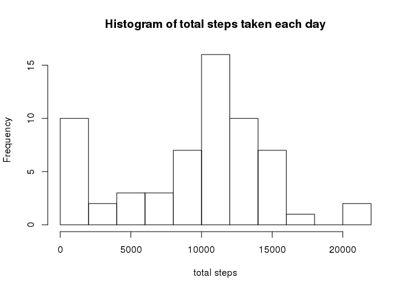
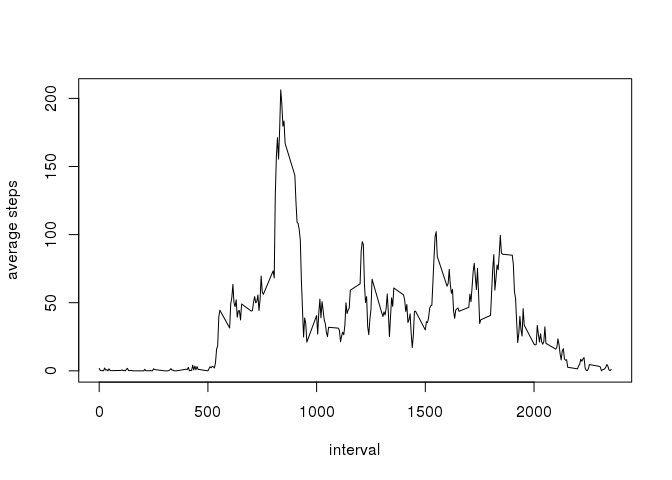
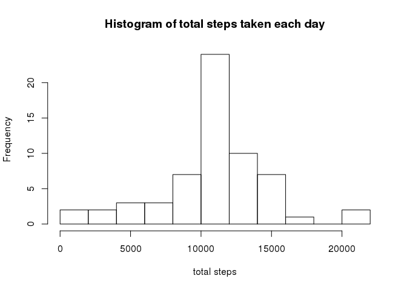
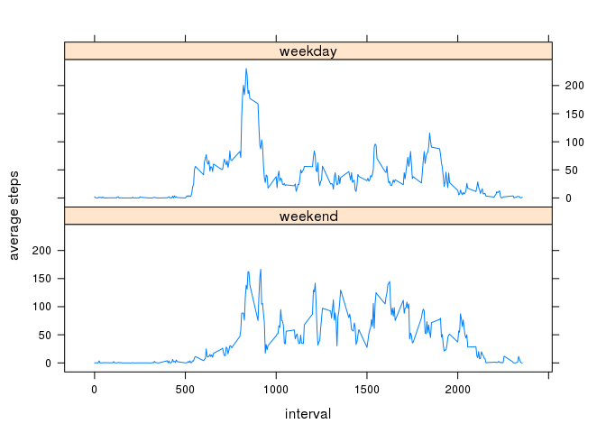

# Reproducible Research: Peer Assessment 1
Stefan Faußer  


- R setup

```r
library(dplyr, warn.conflicts = FALSE)
library(lattice, warn.conflicts = FALSE)
```

## Loading and preprocessing the data


```r
url <- "https://d396qusza40orc.cloudfront.net/repdata%2Fdata%2Factivity.zip"

destfileZip <- "activity.zip" # destination zip archive
fileCsv <- "activity.csv" # package file

# check if the target file exists, download zip archive if not
if(!file.exists(fileCsv))
{
    download.file(url, destfile = destfileZip)
    unzip(destfileZip)
}

data <- read.csv(fileCsv) # load the data

data$date <- as.Date(data$date) # coerce to 'Date' class
# dataComplete <- na.omit(data) # remove 'NA' cases
head(data)
```

```
##   steps       date interval
## 1    NA 2012-10-01        0
## 2    NA 2012-10-01        5
## 3    NA 2012-10-01       10
## 4    NA 2012-10-01       15
## 5    NA 2012-10-01       20
## 6    NA 2012-10-01       25
```

## What is mean total number of steps taken per day?

1. Calculate the total number of steps taken per day.

```r
by_date <- group_by(data, date)
s_data <- summarise(by_date, total = sum(steps, na.rm = TRUE))
head(s_data)
```

```
## Source: local data frame [6 x 2]
## 
##         date total
##       (date) (int)
## 1 2012-10-01     0
## 2 2012-10-02   126
## 3 2012-10-03 11352
## 4 2012-10-04 12116
## 5 2012-10-05 13294
## 6 2012-10-06 15420
```

2. Make a histogram of the total number of steps taken each day.

```r
hist(s_data$total, main="Histogram of total steps taken each day", xlab="total steps", breaks=10)
```



3. Calculate and report the mean and median of the total number of steps taken per day.

```r
mean(s_data$total)
```

```
## [1] 9354.23
```

```r
median(s_data$total)
```

```
## [1] 10395
```

## What is the average daily activity pattern?

1. Make a time series plot (i.e. type = "l") of the 5-minute interval (x-axis) and the average number of steps taken, averaged across all days (y-axis).


```r
by_interval <- group_by(data, interval)
s_data_interval <- summarise(by_interval, average = mean(steps, na.rm = TRUE))
plot(s_data_interval$interval, s_data_interval$average, type='l', xlab="interval", ylab="average steps")
```



2. Which 5-minute interval, on average across all the days in the dataset, contains the maximum number of steps?


```r
s_data_interval$interval[which.max(s_data_interval$average)]
```

```
## [1] 835
```

## Imputing missing values

1. Calculate and report the total number of missing values in the dataset (i.e. the total number of rows with NAs).

```r
sum(is.na(data$steps))
```

```
## [1] 2304
```

2. Devise a strategy for filling in all of the missing values in the dataset. The strategy does not need to be sophisticated. For example, you could use the mean/median for that day, or the mean for that 5-minute interval, etc.

- The strategy is to use the mean of the 5-minute interval for the missing values. Please see the next point for R code.

3. Create a new dataset that is equal to the original dataset but with the missing data filled in.


```r
# s_data_interval with the means already defined, see section 'What is the average daily activity pattern'

data2 <- data # create new dataset

ind <- which(is.na(data2$steps)) # get indices with missing values
intervals <- data2$interval[ind] # get intervals with missing values

# replace missing values with the means
data2$steps[ind] <- subset(s_data_interval, interval %in% intervals)$average

sum(is.na(data2$steps))
```

```
## [1] 0
```

```r
head(data2)
```

```
##       steps       date interval
## 1 1.7169811 2012-10-01        0
## 2 0.3396226 2012-10-01        5
## 3 0.1320755 2012-10-01       10
## 4 0.1509434 2012-10-01       15
## 5 0.0754717 2012-10-01       20
## 6 2.0943396 2012-10-01       25
```

4. Make a histogram of the total number of steps taken each day and Calculate and report the mean and median total number of steps taken per day.


```r
# Calculate the total number of steps taken per day
by_date2 <- group_by(data2, date)
s_data2 <- summarise(by_date2, total = sum(steps, na.rm = TRUE))

# Make a histogram of the total number of steps taken each day
hist(s_data2$total, main="Histogram of total steps taken each day", xlab="total steps", breaks=10)
```



```r
# Calculate and report the mean and median of the total number of steps taken per day
mean(s_data2$total)
```

```
## [1] 10766.19
```

```r
median(s_data2$total)
```

```
## [1] 10766.19
```

4.1 Do these values differ from the estimates from the first part of the assignment?


```r
mean(s_data2$total) - mean(s_data$total)
```

```
## [1] 1411.959
```

```r
median(s_data2$total) - median(s_data$total)
```

```
## [1] 371.1887
```

- The mean and median of the new dataset have (slightly) higher values than the mean and median of the original dataset.

4.2 What is the impact of imputing missing data on the estimates of the total daily number of steps?


```r
head(s_data2)
```

```
## Source: local data frame [6 x 2]
## 
##         date    total
##       (date)    (dbl)
## 1 2012-10-01 10766.19
## 2 2012-10-02   126.00
## 3 2012-10-03 11352.00
## 4 2012-10-04 12116.00
## 5 2012-10-05 13294.00
## 6 2012-10-06 15420.00
```

- Depends on the day. For example for `2012-10-01` the new dataset has a total of `10766.19` while the original dataset has `0` (only `NA` values). In case of `2012-10-02` there are no changes (both data sets have `126`). Generally the new dataset has higher values for the mean and the median, see above.

## Are there differences in activity patterns between weekdays and weekends?

1. Create a new factor variable in the dataset with two levels – “weekday” and “weekend” indicating whether a given date is a weekday or weekend day.


```r
Sys.setlocale("LC_TIME", "C") # set locale to English
```

```
## [1] "C"
```

```r
weekenddays <- c("Saturday", "Sunday")
data2$daytype <- factor((weekdays(data2$date) %in% weekenddays), 
                   levels=c(TRUE, FALSE), 
                   labels=c("weekend", "weekday"))
```

2. Make a panel plot containing a time series plot (i.e. type = "l") of the 5-minute interval (x-axis) and the average number of steps taken, averaged across all weekday days or weekend days (y-axis). See the README file in the GitHub repository to see an example of what this plot should look like using simulated data.


```r
by_interval_daytype <- group_by(data2, interval, daytype)
s_data_interval_daytype <- summarise(by_interval_daytype, average = mean(steps))
xyplot(average ~ interval | daytype, 
       data=s_data_interval_daytype, type='l', xlab="interval",
       ylab="average steps", layout=c(1,2))
```


